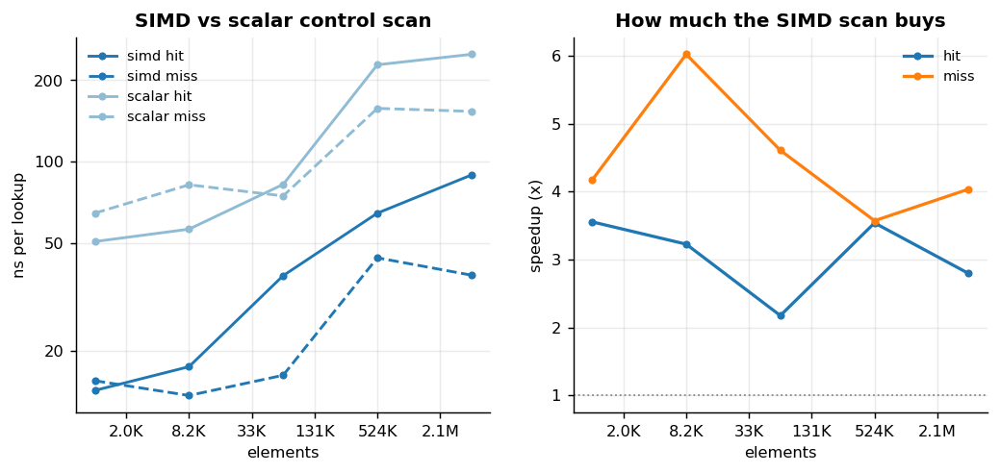
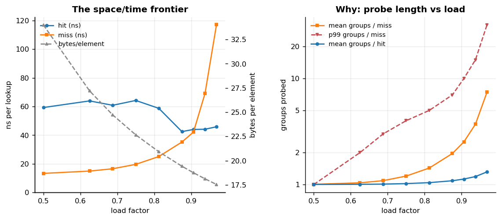
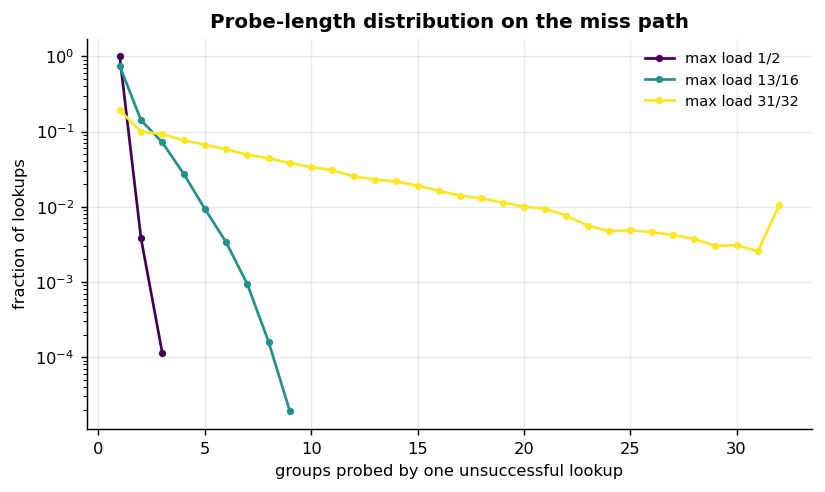
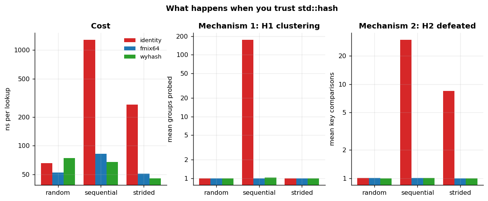
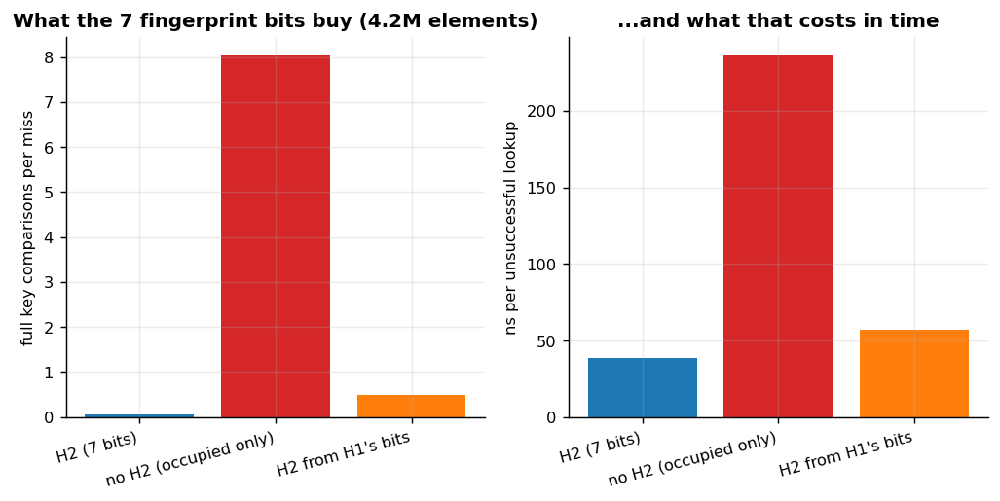
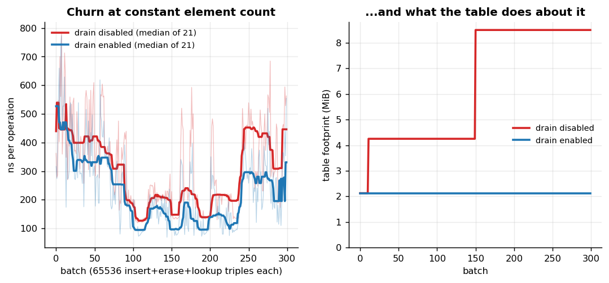
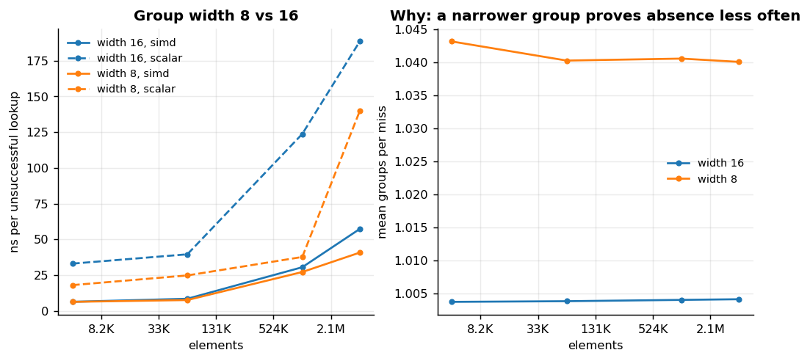
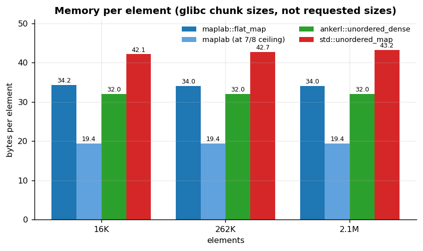

# maplab — experiments

A lab notebook. Each entry is a question, a one-line method, a figure, and a conclusion.
Everything here is reproducible with `./scripts/run_experiments.sh` followed by
`python3 bench/plots/plot.py`; the machine, the timing method and the honest limitations
are in [RESULTS.md](RESULTS.md), which you should read before trusting any absolute number.

**How to read these.** Every experiment reports two kinds of quantity:

- **Counters** — groups probed, key comparisons, fingerprint false positives, capacity,
  tombstones. These are deterministic: same seed, same numbers, every run, on any machine.
- **Times** — nanoseconds. The reference machine is a thermally constrained ultrabook with
  a powersave governor, and its run-to-run spread is 30–45%.

Where the two disagree, believe the counters. They are also the more interesting half:
"this is 6x faster" is a fact about a laptop, while "this performs 0.06 key comparisons
per unsuccessful lookup instead of 8.03" is a fact about the data structure.

Contents:

| # | Question | Headline |
|---|---|---|
| [1](#experiment-1--what-does-the-simd-group-probe-buy) | What does the SIMD probe buy? | 2.3–3.2x on hits, 3.1–5.1x on misses |
| [2](#experiment-2--the-spacetime-frontier) | What does load factor cost? | 2x the density for 7.8x the miss cost, and 7/8 is at the knee |
| [3](#experiment-3--what-happens-when-you-trust-stdhash) | What does a bad hash do? | 176 groups probed per lookup, and *two* distinct failure modes |
| [4](#experiment-4--what-do-the-7-fingerprint-bits-buy) | What do the 7 H2 bits buy? | 0.06 key comparisons per miss instead of 8.03 |
| [5](#experiment-5--tombstones-under-churn) | Do tombstones actually matter? | 4x the memory and 2.3x the time, at a constant element count |
| [6](#experiment-6--group-width-8-vs-16) | Is a 16-byte group better than 8? | Yes, on the miss path — and the null result is the interesting part |
| [7](#experiment-7--memory-per-element) | What does a flat table actually save? | 19.4 B/element vs 43.2 for `std::unordered_map` |

---

## Experiment 1 — what does the SIMD group probe buy?

**Question.** On an identical layout, identical probe order and identical load factor, how
much does replacing the 16-byte SSE2 control scan with a byte-at-a-time scalar scan cost?

**Method.** One template parameter. `maplab::default_config` and `maplab::scalar_config`
differ in exactly one member, so both tables allocate the same bytes, place the same keys
in the same slots, and probe the same groups in the same order. Both are built, and their
four measurements are then interleaved so a clock change cannot advantage either. The
experiment asserts that the two agree on groups-probed before reporting anything — that
column is the proof this is an ablation and not a comparison of two data structures.

**Result.** The SIMD probe is roughly **2.3–3.2x faster on hits and 3.1–5.1x faster on
misses**, consistently across five orders of magnitude of table size, with `groups/lookup`
identical to three decimal places in every row.

**Conclusion.** The miss path benefits more than the hit path, and the reason is structural
rather than incidental. A hit's work is "find the one matching fingerprint", which the
scalar loop can exit early on. A miss's work is "prove no byte in this group is empty",
which is a single `_mm_cmpeq_epi8` + `_mm_movemask_epi8` for SIMD and an unavoidable
16-iteration loop for scalar — there is nothing to exit early from. That asymmetry is worth
knowing, because miss-heavy workloads (caches, dedup filters, "have I seen this ID before")
are exactly where the difference is largest.

**The honest nuance.** The speedup does *not* grow with table size; if anything it
compresses at the largest sizes, where both variants are waiting on the same DRAM access
and the scan is hidden behind memory latency. The SIMD probe buys instructions, and
instructions only matter when you are not already stalled.

---

## Experiment 2 — the space/time frontier

**Question.** What does raising the maximum load factor actually cost per lookup, and what
does it save in memory?

**Method.** Nine configurations from 1/2 to 31/32, each filled to *exactly* its own growth
ceiling (`growth_left() == 0`) on an array of the same 2^19 − 1 capacity, so the only thing
varying between rows is how much of the array holds live elements. All nine tables are
built first and their eighteen measurements interleaved.

| max load | α | bytes/elem | groups/hit | groups/miss | p99 groups/miss | keycmp/hit |
|---|---|---|---|---|---|---|
| 1/2 | 0.500 | 34.0 | 1.000 | 1.004 | 1 | 1.004 |
| 3/4 | 0.750 | 22.7 | 1.019 | 1.201 | 4 | 1.012 |
| **7/8** | **0.875** | **19.4** | **1.084** | **1.959** | **7** | **1.024** |
| 15/16 | 0.937 | 18.1 | 1.188 | 3.708 | 15 | 1.038 |
| 31/32 | 0.969 | 17.5 | 1.314 | 7.418 | 32 | 1.055 |

**Result.** Doubling the density (34.0 → 17.5 bytes/element) costs about **7.8x on the miss
path** (33 → 260 ns) while leaving hits essentially flat.

**Conclusion.** The two halves of a lookup scale completely differently, and the mean hides
it. A *hit* resolves in its home group at almost any load — 1.00 groups at α = 0.5 and
still only 1.31 at α = 0.97 — because the fingerprint finds the key wherever it is. A
*miss* must prove absence by finding an empty control byte, and the probability that a
group of 16 contains none rises as roughly α^16. That is the entire shape of the miss
curve.

The tail is worse than the mean and matters more: at α = 0.875 the mean miss touches 1.96
groups but the 99th percentile touches **7**, and at α = 0.969 the p99 touches **32** —
the histogram's saturating bin. Each additional group is another chance at a cache miss, so
a p99 of 32 is a latency cliff, not a 32x slowdown on average.

**Why 7/8 is the right default.** It sits at the knee. Going from 3/4 to 7/8 buys 15% memory
for 1.6x the mean miss probes; going from 7/8 to 15/16 buys only a further 7% memory for
another 1.9x. The marginal density gets cheap in bytes and expensive in tail latency at
almost exactly that point.

---

## Experiment 3 — what happens when you trust `std::hash`

**Question.** A power-of-two capacity indexed by masking only ever looks at the low bits of
the hash, and `std::hash<integer>` is the identity function on both libstdc++ and libc++.
What does that combination cost, and on which inputs?

**Method.** Three hashers (identity, murmur3 `fmix64`, wyhash) crossed with three key
patterns: uniform random, sequential `0..N` and strided `i << 12`. Sequential is not a
strawman — order IDs, row IDs, timestamps and file offsets are all sequential; strided is
what aligned pointers and IDs with a fixed low-order field look like. Within each pattern
the three hashers are measured interleaved.

| hash | keys | groups/hit | keycmp/hit | p99 groups |
|---|---|---|---|---|
| identity | random | 1.000 | 1.004 | 1 |
| identity | **sequential** | **175.787** | **29.708** | **32** |
| identity | **strided** | 1.000 | **8.500** | 1 |
| fmix64 | sequential | 1.000 | 1.004 | 1 |
| wyhash | sequential | 1.019 | 1.010 | 2 |

**Result.** Identity hashing is fine on random keys, and catastrophic on both structured
patterns — but *catastrophic in two completely different ways*, which only the counters
distinguish.

**Conclusion.** This experiment refuted its own stated hypothesis, which is why it is worth
reading carefully.

The prediction written before running it was: sequential keys will be *fine* under identity
hashing, because consecutive integers mask to consecutive slots — a perfect permutation
with no collisions at all. That reasoning forgot that the table does not index by the hash.
It indexes by **H1 = hash >> 7**. With identity hashing, 128 consecutive integers therefore
share a home group, and a group is 16 slots wide: the table is 8x oversubscribed at every
home position. Measured: **175.8 groups probed per lookup**, versus 1.000 with any real
mixer.

The strided case fails for the opposite reason. `i << 12` has no low bits, so **H2 = hash &
0x7F is 0 for every key**. Home groups stay well spread (`groups/hit` remains 1.000), but
every occupied slot in the group is a fingerprint match, so each lookup pays a full key
comparison per resident: **8.5 comparisons per hit**. This is Experiment 4's H2 ablation,
arrived at by accident through the key distribution instead of on purpose through a config
flag.

Neither failure is repairable by better probing, a wider group, or a lower load factor.
This is the argument for the table owning its mixer rather than inheriting whatever
`std::hash` the key type happened to come with — and it is why `maplab::identity_hash`
ships in the public header, so the failure is a template argument rather than a warning in
a comment.

---

## Experiment 4 — what do the 7 fingerprint bits buy?

**Question.** A control byte could simply say "occupied". It instead spends 7 of its 8 bits
on a hash fingerprint. How much work does that save?

**Method.** Three configurations differing *only* in what the control byte carries, with
layout, probe order and load factor untouched:

- **H2 (7 bits)** — the default: H2 = `hash & 0x7F`, H1 = `hash >> 7`, disjoint bits.
- **no H2** — every occupied byte stores 0, so the group match returns every occupied slot.
- **H2 from H1's bits** — H2 is still stored, but the group is chosen from the whole hash
  instead of from H1, so slots within a group share most of their fingerprint bits.

All three are built and their six measurements interleaved.

| variant | keycmp/hit | keycmp/miss | H2 false-positive rate |
|---|---|---|---|
| **H2 (7 bits)** | 1.004 | **0.064** | **0.37%** |
| no H2 (occupied only) | 1.502 | **8.031** | 33.41% |
| H2 from H1's bits | 1.251 | 0.503 | 20.05% |

**Result.** The fingerprint reduces full key comparisons on the miss path from **8.03 to
0.06 per lookup**, a factor of 125, and misses run roughly **6x faster** as a result.

**Conclusion.** Three things fall out of this table, and all three are checkable against
theory rather than merely plausible.

*The 8.03 is not a measurement, it is a prediction confirmed.* Without a filter, a miss
compares every occupied slot in every group it probes. At load factor 0.5 with 16-slot
groups that is 0.5 × 16 = 8.0 expected comparisons. Measured: 8.031.

*The 0.37% is the 1/128 the design promised.* A 7-bit fingerprint should produce a
false-positive rate of 1/128 = 0.78% per occupied slot examined; the measured rate over all
comparisons is 0.37%, lower because probes that find their key stop early. The filter is
doing exactly what the arithmetic says it should.

*The third row is the one worth the whole experiment.* It stores the same seven bits and it
still fails, at **20.05% false positives — 54x worse than the disjoint version**. If the
group is chosen from the whole hash, the 16 slots reachable in one group differ only in
their low 4 bits, which are also fingerprint bits, so every candidate in a group shares
most of its fingerprint. maplab shipped this bug for about an hour during development; no
test caught it, because the table was perfectly correct. The stats block caught it, which
is the clearest argument this project has for building the instrument before the
optimisation.

---

## Experiment 5 — tombstones under churn

**Question.** A flat table cannot simply empty a slot on erase — an empty byte terminates
probe chains, and any chain running through that slot would be truncated. It leaves a
tombstone instead, which occupies a slot that neither holds an element nor ends a probe.
What happens to a table that churns forever, and does the drain policy fix it?

**Method.** Pin the element count at 65 536 and run 300 batches of 65 536 insert + erase +
lookup triples, so nothing grows because the table is filling with *elements*. Two
configurations differing in one bool, advanced **in lockstep**, one batch each, alternating.

| batch | drain disabled: capacity / MiB | drain enabled: capacity / MiB |
|---|---|---|
| 0 | 131 071 / 2.1 | 131 071 / 2.1 |
| 60 | 262 143 / 4.3 | 131 071 / 2.1 |
| 180 | 524 287 / 8.5 | 131 071 / 2.1 |
| 299 | 524 287 / 8.5 | 131 071 / 2.1 |

**Result.** With the drain disabled the table **grows twice and ends at 4x the memory**,
despite holding exactly the same 65 536 elements from first batch to last. With it enabled,
capacity never changes: 25 in-place rehashes hold the footprint at 2.1 MiB forever. By the
final batches the bloated table is also about **2.3x slower** per operation.

**Conclusion.** This is the clearest structural result in the repo, and the mechanism is
worth stating precisely: tombstones consume the *growth budget*, not just space. Once
`size + tombstones` reaches the ceiling, the table grows — even though `size` alone has not
moved since the beginning. Memory doubles, the working set leaves L3, and lookups slow
down permanently. Nothing about this is self-correcting; the graph would keep stepping
upward for as long as the workload ran.

The time penalty lags the memory penalty, and that is not noise. Up to batch ~150 both
tables fit in this machine's 6 MB L3 and cost the same; the divergence appears when the
bloated table crosses 8.5 MiB and stops fitting. **A memory regression became a latency
regression at a cache boundary** — which is the general lesson, and the reason the memory
panel is the one to read first.

**Caveat, stated plainly.** A batch advances the table's state and so cannot be repeated and
minimised like every other measurement here; the timing series is single-shot and
correspondingly noisy, which is why the figure shows both the raw points and a rolling
median. The capacity and footprint columns carry this result.

**What this does not show.** maplab drains by rehashing into a fresh allocation of the same
size, so a drain transiently doubles the footprint. Abseil does the same job in place. That
is a real advantage maplab does not have, and it is on the roadmap rather than argued away.

---

## Experiment 6 — group width 8 vs 16

**Question.** A 16-byte group is one SSE2 register. An 8-byte group halves the control bytes
examined per probe but doubles the probe steps needed to cover the same ground. Does the
wider group win?

**Method.** `Config::group_width` crossed with the probe policy, at four table sizes.
Everything else is identical; only the scan granularity and therefore the probe stride
change. Four configurations, eight measurements, all interleaved.

**Result.** On hits, essentially a wash. On misses, width 16 wins, and the counters say
exactly why: a narrower group contains an empty byte less often, so a miss takes more probe
steps to prove absence.

**Conclusion.** A null result on the hit path is still a result, and this one is more
informative than a win would have been. The hit path is dominated by the cache miss on the
slot, which both widths pay identically — the scan is free either way. The miss path is
where group width shows up, because proving absence is precisely the operation whose cost
depends on how much of the control array you can test at once.

The practical reading: **the win comes from the layout, not from the register width.** One
control byte per slot, scanned in bulk, with an empty byte terminating the probe — that is
the design. SSE2 is how this implementation performs the scan on x86-64; the same structure
with a NEON `vshrn` narrowing trick, or with SWAR over a `uint64_t`, would keep most of the
benefit. That is a reassuring thing to know before porting, and it is the difference between
"we use SIMD" and understanding what the SIMD is for.

---

## Experiment 7 — memory per element

**Question.** A flat map's memory story is usually told as "no node, no next pointer". What
is the actual number, including the control byte and the empty slots the load factor
requires?

**Method.** A counting global `operator new`/`delete` that charges each allocation what it
costs the **heap**, not what was requested: on glibc a 24-byte node occupies a 32-byte
chunk, so counting requests would credit a node-based map with 25% memory it does not have.
`malloc_usable_size(p) + 8` is exactly the glibc chunk size.

| implementation | bytes/element (2M) | vs maplab at ceiling |
|---|---|---|
| **maplab, at its 7/8 ceiling** | **19.43** | 1.00x |
| ankerl::unordered_dense | 32.00 | 1.65x |
| maplab, after inserting n keys | 34.00 | 1.75x |
| std::unordered_map | 43.21 | 2.22x |

**Result.** At its growth ceiling maplab costs **19.43 bytes per element**, against a
predicted (16 + 1) / 0.875 = 19.43. `std::unordered_map` costs **2.2x** that.

**Conclusion.** The honest statement about a flat table's density is a *range*, not a
number. Capacity is a power of two, so the load factor cycles between about 0.44 and 0.875
as the table grows: 19.4 bytes/element at the ceiling, 34.0 just after a rehash. Quoting
only the first is the sort of thing that makes benchmarks untrustworthy, so both rows are
in the table.

`std::unordered_map`'s cost is different in kind — it is structural rather than cyclical. A
next pointer plus a separate heap chunk per element is a cost no load factor can reclaim,
and it is the same property (pointer stability on every operation, plus the bucket API)
that the standard requires and that makes the pointer chase unavoidable. See
[DESIGN.md §11](DESIGN.md#11-api-surface-and-the-iterator-contract).

`ankerl::unordered_dense` beats maplab even at the ceiling, and the reason is a genuinely
different trade: it stores values in a dense `std::vector` with a separate index array, so
it wastes nothing on empty slots and iterates beautifully — at the cost of an extra
indirection on lookup and a swap-with-last on erase that invalidates references and
reorders iteration. Losing to it here is not a defect to explain away; it is a different
point on the same frontier.

---

## What is not here

Experiments the plan called for that this repo does not (yet) answer, listed so their
absence is a decision rather than an omission:

- **Prefetching the slot line during the control probe.** The knob exists
  (`Config::prefetch`) and is in the test matrix, but this machine's timing noise is larger
  than the effect being measured, so there is no result worth publishing.
- **Growth factor 1.5 vs 2.** Not measurable here, and not by accident: a power-of-two
  capacity indexed by masking *forces* a factor of 2. A 1.5x factor needs a non-power-of-two
  capacity and therefore a modulo or a Lemire reduction on the hottest path in the
  structure. This is a decision made upstream by the choice of masking, not an experiment.
- **Backward-shift deletion** as a third line in Experiment 5. Not implemented.
- **Hardware performance counters** (cache misses and instructions per operation).
  `perf_event_paranoid` is 4 on this machine. maplab's software counters cover the same
  analytical ground, which is what every experiment above actually relies on.
