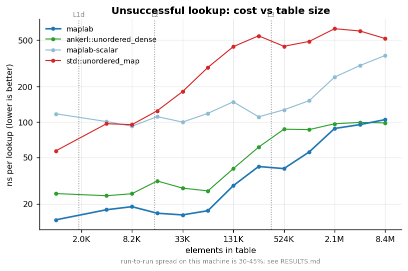

# maplab

**A Swiss-table-style flat hash map in C++23, built as a measurement laboratory.**

maplab is an open-addressing hash map with SSE2 group probing, a 7-bit fingerprint filter,
and one contiguous allocation — the Abseil/Boost/folly family of designs. What makes it a
*lab* is that every major design decision is a compile-time configuration, and every one of
them has been implemented, toggled, measured and written up.

The claim is not that it is faster than Abseil. The claim is that this repo can tell you,
with numbers, **what each design decision is worth and why** — including the ones that
turned out not to matter, and the two hypotheses that measurement refuted.



<sub>Cost of an unsuccessful lookup from L1-resident to well past DRAM. `maplab-scalar` is
the same table with the SIMD group scan replaced by a byte-at-a-time loop — the ablation,
not a different map. Reference lines are context, not targets. Reference machine and noise
figures in [RESULTS.md](RESULTS.md).</sub>

---

## Design decisions, measured

Every row links to a full lab-notebook entry with method, figure and conclusion.

| Decision | What it buys | Measured |
|---|---|---|
| [SIMD group probe vs scalar](EXPERIMENTS.md#experiment-1--what-does-the-simd-group-probe-buy) | 2.3–3.2x on hits, **3.1–5.1x on misses** | identical `groups/lookup`, so the difference is the scan and nothing else |
| [Load factor 7/8](EXPERIMENTS.md#experiment-2--the-spacetime-frontier) | 2x the density for 7.8x the miss cost | mean miss probes 1.00 → 7.42 across α = 0.5 → 0.97; **p99 goes 1 → 32** |
| [Owning the hash mixer](EXPERIMENTS.md#experiment-3--what-happens-when-you-trust-stdhash) | survival on structured keys | `std::hash` + sequential IDs ⇒ **175.8 groups probed per lookup** |
| [The 7-bit H2 fingerprint](EXPERIMENTS.md#experiment-4--what-do-the-7-fingerprint-bits-buy) | **0.06 key comparisons per miss instead of 8.03** | measured false-positive rate 0.37%, against a predicted 1/128 |
| [H1 and H2 from disjoint bits](EXPERIMENTS.md#experiment-4--what-do-the-7-fingerprint-bits-buy) | the filter actually filtering | same 7 bits from overlapping bits ⇒ **54x worse false-positive rate** |
| [Draining tombstones](EXPERIMENTS.md#experiment-5--tombstones-under-churn) | a bounded table under churn | without it: **4x the memory** at a constant element count, then 2.3x the time |
| [Group width 16 vs 8](EXPERIMENTS.md#experiment-6--group-width-8-vs-16) | a little, on the miss path only | a null result on hits — the win is the *layout*, not the register width |
| [Flat storage](EXPERIMENTS.md#experiment-7--memory-per-element) | **19.4 B/element vs 43.2** for `std::unordered_map` | counted with a real heap-chunk allocator, not `sizeof(node)` |

Two of these entries exist because the instrument caught something no test could:

- **The H2 bug.** During development, H1 and H2 were cut from overlapping bits of the hash.
  The table was perfectly correct and every test passed. The stats block reported a 26%
  fingerprint false-positive rate against a theoretical 0.78%, which is how the bug was
  found. It is now a configuration flag and a measured result.
- **A refuted hypothesis.** Experiment 3 predicted that sequential integer keys under
  identity hashing would be *fine*, since consecutive integers mask to consecutive slots.
  They are not: the table indexes by `H1 = hash >> 7`, so 128 consecutive keys share one
  16-slot home group. The prediction, the refutation and the mechanism are all in the
  notebook, because a lab notebook that only records the confirmations is not a lab
  notebook.

---

## How it works

One allocation, one control byte per slot:

```
+----------------+---+--------+-----+------------------------------+
| control bytes  | S | cloned | pad | slots: pair<Key,T> * capacity |
+----------------+---+--------+-----+------------------------------+
 <-- capacity --> ^   <- w-1 ->
                  ctrl[capacity] = sentinel
```

A lookup is:

```cpp
__m128i ctrl  = _mm_loadu_si128(...);                        // 16 control bytes
__m128i match = _mm_cmpeq_epi8(ctrl, _mm_set1_epi8(h2));
uint32_t candidates = _mm_movemask_epi8(match);              // every candidate, as a bitmask
// ...compare keys only at those positions...
if (_mm_movemask_epi8(_mm_cmpeq_epi8(ctrl, empty))) return end();   // the miss fast path
```

- **H1 = `hash >> 7`** picks the group; **H2 = `hash & 0x7F`** is the fingerprint stored in
  the control byte. Disjoint bits, for the reason Experiment 4 measures.
- **SSE2, no runtime dispatch.** SSE2 is part of the x86-64 baseline, so there is no CPU to
  dispatch for and no scalar fallback to keep alive in production. The scalar probe exists
  anyway, as Experiment 1's control group — and it is in the differential test matrix,
  because an ablation baseline that is allowed to be wrong is not a baseline.
- **Triangular probing** between groups visits every group exactly once at a power-of-two
  capacity, so probing terminates having examined every slot. The proof sketch is in
  [DESIGN.md §6](DESIGN.md#6-probe-sequence-triangular-numbers); the property is checked in
  `tests/test_control.cpp`.
- **Slots are raw storage**: `operator new` with an alignment, `std::construct_at`,
  `std::destroy_at`, and a union that lets a rehash *move* the key out of a
  `pair<const Key, T>` instead of copying it.

[DESIGN.md](DESIGN.md) is the full design document — layout, the control-byte encoding,
deletion, exception safety, the iterator-invalidation contract, and a "known limitations"
section that names the deviations rather than hiding them.

---

## Using it

Header-only, C++23, x86-64.

```cpp
#include "maplab/flat_map.hpp"

maplab::flat_map<std::uint64_t, Order> book;
book.reserve(expected);                       // genuinely pre-sizes; no rehash after this
book.try_emplace(order_id, Order{...});       // the allocation-free insert path

if (auto it = book.find(order_id); it != book.end()) {
  it->second.quantity -= filled;
}
book.erase(order_id);

// Heterogeneous lookup works out of the box: no temporary std::string is constructed.
maplab::flat_map<std::string, Quote> symbols;
symbols.try_emplace("AAPL", q);
symbols.find(std::string_view{"AAPL"});
```

With CMake:

```cmake
add_subdirectory(maplab)
target_link_libraries(your_target PRIVATE maplab::maplab)
```

`insert` / `emplace` / `try_emplace` / `insert_or_assign` / `find` / `contains` / `count` /
`at` / `operator[]` / `equal_range` / `erase` / `reserve` / `rehash` / `clear` / `swap` /
iterators, plus `capacity()`, `load_factor()`, `tombstones()` and `memory_usage()` for when
you want to know what the table is actually doing.

**Configuring it.** Every design decision is a member of a config struct, and configs
compose by inheritance:

```cpp
struct my_config : maplab::default_config {
  static constexpr std::size_t max_load_num = 3;   // 3/4 instead of 7/8
  static constexpr std::size_t max_load_den = 4;
  static constexpr bool stats = true;              // compile in the probe counters
};
maplab::flat_map<K, V, maplab::default_hash, std::equal_to<>, my_config> m;
std::cout << m.stats();   // groups/lookup, key comparisons, H2 false positives, ...
```

The counters cost nothing when off: `sizeof(flat_map)` is five words, and
`tests/test_zero_cost.cpp` static-asserts that every ablation config has an identical
layout — so an ablation measures a code change, not a different data structure.

---

## Correctness

The measurements are only worth reading if the table is right, so that comes first.

- **Differential testing against `std::unordered_map`.** Randomised operation sequences —
  insert, try_emplace, insert_or_assign, `operator[]`, erase by key and by iterator,
  reserve, rehash, clear, copy round-trip, find — applied to both and compared throughout,
  plus the exact accounting identity `size + tombstones + growth_left == ceiling` checked
  every 997 operations. Run against **all twelve configurations**, including every ablation
  variant. 67M assertions under ASan + UBSan.
- **Coverage-guided differential fuzzing** (`fuzz/fuzz_ops.cpp`, libFuzzer) drives the same
  comparison from coverage feedback, to reach the states a uniform random distribution
  will not: 334K cases clean.
- **Hand-built adversarial cases** the random tests would take forever to find: keys sharing
  H1 but not H2, keys sharing H2 but not H1, keys with *identical* hashes, probe chains made
  entirely of tombstones, growth triggered mid-probe-chain, and a hasher that returns 0 for
  everything.
- **Lifetime tests** with a type that counts its own constructions and destructions, because
  ASan sees a use-after-free through a raw byte buffer only sometimes. Includes a
  throwing-constructor test for the basic exception guarantee.
- **The control layer tested on its own**: the SIMD and scalar groups must agree on all four
  bitmasks over 20 000 randomised control arrays, and the triangular probe sequence must
  provably visit every group exactly once.
- **ASan + UBSan** (`-fno-sanitize-recover=undefined`), `-Werror` with a wide warning set,
  clang-tidy, GCC 13 and Clang 19, in CI.

```bash
cmake --preset debug-san && cmake --build --preset debug-san && ctest --preset debug-san
```

**These tests found real bugs**, and they are documented rather than quietly fixed: a drain
heuristic that was silently hard-coded for a 7/8 ceiling and looped forever at 1/2 (found by
having ablation configs *in the test matrix*), and a zero-capacity `rehash(0)` that leaked
its control array (found by ASan).

---

## Reproducing the numbers

```bash
cmake --preset release && cmake --build --preset release
ctest --preset release                                   # correctness first
./scripts/run_experiments.sh                             # -> results/*.csv
./scripts/run_bench.sh                                   # -> results/bench.json
python3 bench/plots/plot.py --results results --out docs/img
```

Every figure in this README and in [EXPERIMENTS.md](EXPERIMENTS.md) is produced by that
script from those files, so any claim here traces back to a number in a file.

[RESULTS.md](RESULTS.md) documents the reference machine, the timing methodology, and the
limitations — read it before trusting an absolute nanosecond figure. The short version:
**this is a thermally constrained ultrabook with a powersave governor and 30–45% run-to-run
spread.** It is the wrong machine for absolute numbers and a perfectly good one for
ablations, which compare two configurations under identical conditions. The counters —
groups probed, key comparisons, fingerprint false positives — are deterministic and
identical on any machine, and they are what the conclusions actually rest on.

Three methodology decisions worth stating, because each one changed a result:

1. **Timing and counting are separate runs.** A `probe_stats` update per lookup is not free;
   timing an instrumented build inflated the first Experiment 1 run by ~8x.
2. **Alternatives are measured interleaved**, A/B/A/B, not all of A then all of B. On this
   machine sustained load drops the clock several-fold, which systematically favoured
   whichever variant ran first.
3. **Lookups walk a shuffled key array sequentially** rather than indexing through a random
   permutation. The permutation array costs a second random memory access per lookup; past
   8M elements, two thirds of the measured cache misses belonged to the harness.

---

## Non-goals and limitations

Stated because unstated limitations read as ignorance.

- **Single-threaded.** A concurrent flat map is a different and much harder project.
- **x86-64 / SSE2 only.** Experiment 6 suggests the win is in the layout rather than the
  register width, which is encouraging for a NEON port but does not constitute one.
- **No allocator support**, no `pmr`, no node handles.
- **No pointer stability.** Structurally impossible in a flat table, and precisely why
  `std::unordered_map` is slow. The invalidation contract is written down in
  [DESIGN.md §11](DESIGN.md#11-api-surface-and-the-iterator-contract).
- **Types with throwing move constructors are rejected at compile time**, with a
  `static_assert` that explains why. A documented scope limitation.
- **`value_type` is `std::pair<const Key, T>`** implemented over a union so rehashing can
  move the key. This relies on layout compatibility and the common-initial-sequence rule —
  universal practice, not airtight standardese. [DESIGN.md §9](DESIGN.md#9-memory-management-and-lifetimes)
  explains the alternative and why it was not taken.
- **The drain rehashes into a fresh allocation** rather than in place, so it transiently
  doubles the footprint. Abseil does this better.
- **Not benchmarked against Abseil by default.** `-DMAPLAB_WITH_ABSEIL=ON` adds it;
  `ankerl::unordered_dense` and `std::unordered_map` are always present.

## Roadmap

1. In-place drain, to remove the transient double footprint.
2. NEON port of the group probe (`vshrn` narrowing in place of `movemask`).
3. Backward-shift deletion, as a third line in Experiment 5.
4. `perf stat` counters — cache misses and instructions per operation — on a machine where
   `perf_event_paranoid` permits it.
5. A `flat_set` sharing the same control layer.

## References

The design follows Abseil's `raw_hash_set` (Sam Benzaquen, Alkis Evlogimenos, Matt Kulukundis
and Roman Perepelitsa; see Kulukundis, *"Designing a Fast, Efficient, Cache-friendly Hash
Table, Step by Step"*, CppCon 2017), with the load-factor accounting, the drain threshold and
the configuration/ablation architecture reworked as described in [DESIGN.md](DESIGN.md).
Reference implementations: [`ankerl::unordered_dense`](https://github.com/martinus/unordered_dense)
(vendored, MIT) and `absl::flat_hash_map` (optional).

## License

MIT. See [LICENSE](LICENSE).
